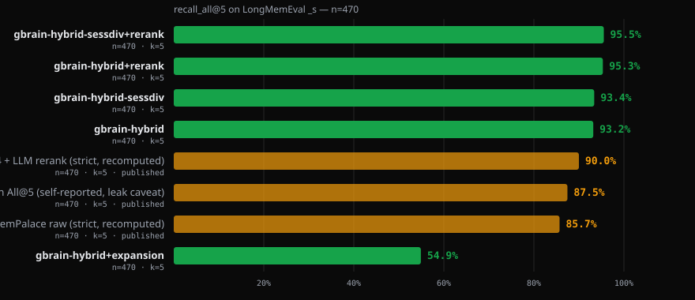
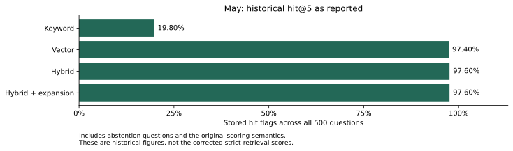
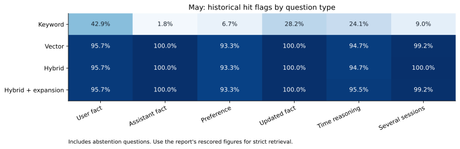

# LongMemEval: finding the conversations needed to answer a question

First run May 7, 2026, on gbrain v0.28.8. Rescored August 31; raw rows published September 1; five new configurations measured September 2 on v0.48.2.0.

This report's first headline was 97.60%. That number answered an easier question than we intended: did search find **any** conversation containing part of the answer? The benchmark's strict metric asks whether search found **every** required conversation. Rescoring the same May results gave 83.40%.

The correction changed what we learned. A system could find one session about a topic yet miss the second session needed to add up a total, compare two dates, or recognize a changed preference. The nearly perfect old score hid those failures.

Later gbrain changes improved strict retrieval. The September 2 hybrid run reached 93.19% without reranking and 95.32% with reranking, both with autocut explicitly off. The [September 6 report](2026-09-06-longmemeval-ranker-wave.md) is the newer release experiment: 95.53% strict retrieval and a separate 86.6% judged answer-accuracy result. The [September 9 refresh](2026-09-09-retrieval-refresh.md) verifies stored retrieval evidence and updates smaller fixtures.

## What the benchmark measures

[LongMemEval](https://github.com/xiaowu0162/LongMemEval), by Wu and colleagues, asks 500 questions about past conversations. This report uses the small `_s` history, roughly 50 sessions per question. Its harder `_m` split has much larger histories and was not run here. The [cleaned dataset](https://huggingface.co/datasets/xiaowu0162/longmemeval-cleaned) keeps the questions and gold labels while removing filler sessions.

The labels identify sessions needed for each answer. Thirty questions ask about something that was never discussed; retrieval metrics exclude those abstention cases and use 470 questions. Answer accuracy should include them because the right behavior is to decline to invent an answer.

A strict hit means all gold sessions occur among the sessions represented by the first five returned chunks. A loose any-hit means at least one does. Several chunks can come from one session. The separate `sessdiv` experiment fetches more chunks and fills five distinct session slots; ordinary top-five chunk retrieval does not guarantee that diversity.

For example, “What was the first problem after my car's service?” requires more than a thematically similar car conversation. Search must return the right event in the right period. “How did my preference change?” may require both an earlier and a later session. Finding either one is incomplete evidence.

The six question categories cover user statements, assistant statements, preferences, multi-session questions, changing knowledge, and temporal reasoning. These test retrieval, not whether an answering model can use the retrieved text correctly.

## September 2: five configurations on the corrected metric

This run pinned gbrain v0.48.2.0 (`5cfb84f1`, PR 4792, branch `yaounde`) and the gbrain-evals runner from main `29e9ac9` with that dependency. It used the cleaned September-2025 dataset revision, OpenAI `text-embedding-3-large` at 1,536 dimensions, fixed dataset order, and zero error rows in each complete arm.

Mode was `balanced` and autocut was **off in every arm**. Reranker-on arms used Voyage `rerank-2.5`. The historical tables call them the “release default path,” but they disabled the autocut setting that the release then shipped. They therefore measured the default reranker with an explicit configuration override, not an untouched new install.

| Adapter | official `recall_all@5` | any-hit `recall_any@5` (diagnostic) | nDCG_any@5 | distinct sessions in top-5 (mean) | paired vs gbrain-hybrid (gained / lost) | p50 / p99 per question, wall | Status |
|---|---|---|---|---|---|---|---|
| **gbrain-hybrid** (reranker off; the like-for-like row vs May 2026 and v0.48.0.0) | **93.19%** (438/470) | 98.72% | 93.32% | 4.90 (5 sessions on 422 questions, 4 on 47, 3 on 1) | reference | 3,707 ms / 6,348 ms, 1,977 s | complete, 0 errors |
| gbrain-hybrid+expansion (tokenmax's LLM multi-query expansion, reranker off) | 54.89% (258/470) | 86.60% | 71.68% | 5.00 | +3 / -183 | 5,079 ms / 8,014 ms, 2,677 s | complete, 0 errors; harmful at k=5 (v0.48.0.0 receipt: 49.6%) |
| gbrain-hybrid-sessdiv (3x over-fetch, top-5 distinct sessions, reranker off) | 93.40% (439/470) | 98.72% | 93.38% | 5.00 | +1 / -0 | 3,701 ms / 6,371 ms, 1,987 s | complete, 0 errors; first measurement |
| **gbrain-hybrid+rerank** (`voyage:rerank-2.5` ON; the release default path) | **95.32%** (448/470) | 99.79% | 95.77% | 4.89 | +18 / -8 | 3,821 ms / 6,298 ms, 2,029 s | complete, 0 errors; first reranker-on measurement |
| gbrain-hybrid-sessdiv+rerank (`voyage:rerank-2.5` ON; release default path plus over-fetch) | 95.53% (449/470) | 99.79% | 95.82% | 5.00 | +19 / -8 | 3,795 ms / 6,317 ms, 2,031 s | complete, 0 errors; first reranker-on measurement |

The reranker added 18 strict hits and lost eight, for a net gain of ten. Median benchmark time rose by 114 ms, from 3,707 to 3,821 ms per question, with one Voyage rerank call per query. These timings include benchmark work beyond steady-state search.

Session over-fetch added one strict hit with and without the reranker. That is a modest measured benefit, not proof that repeated sessions never matter. There are also three questions with six required sessions, which cannot fit in five session slots; the maximum possible strict score at that budget is 467/470, about 99.4%.

Expansion without reranking was harmful in this release: 258/470 strict hits, with three gains and 183 losses relative to hybrid. It also raised median benchmark time to 5,079 ms. This is a result for the explicit expansion/reranker-off configuration, not the final released tokenmax bundle studied September 6.



| question_type | n | gbrain-hybrid (reranker off) | gbrain-hybrid+expansion | gbrain-hybrid-sessdiv | gbrain-hybrid+rerank (release default) | gbrain-hybrid-sessdiv+rerank | May 2026, v0.28.8 |
|---|---|---|---|---|---|---|---|
| knowledge-update | 72 | 98.6% (71/72) | 62.5% (45/72) | 98.6% (71/72) | 100.0% (72/72) | 100.0% (72/72) | 98.6% |
| multi-session | 121 | 92.6% (112/121) | 34.7% (42/121) | 92.6% (112/121) | 92.6% (112/121) | 92.6% (112/121) | 71.9% |
| single-session-assistant | 56 | 100.0% (56/56) | 82.1% (46/56) | 100.0% (56/56) | 100.0% (56/56) | 100.0% (56/56) | 100.0% |
| single-session-preference | 30 | 96.7% (29/30) | 80.0% (24/30) | 96.7% (29/30) | 100.0% (30/30) | 100.0% (30/30) | 93.3% |
| single-session-user | 64 | 98.4% (63/64) | 78.1% (50/64) | 98.4% (63/64) | 100.0% (64/64) | 100.0% (64/64) | 96.9% |
| temporal-reasoning | 127 | 84.3% (107/127) | 40.2% (51/127) | 85.0% (108/127) | 89.8% (114/127) | 90.6% (115/127) | 69.3% |
| **all types** | **470** | **93.19% (438/470)** | **54.89% (258/470)** | **93.40% (439/470)** | **95.32% (448/470)** | **95.53% (449/470)** | **83.40%** |


Temporal strict hits rose from 107/127 to 114/127 with reranking and 115/127 with reranking plus session over-fetch. Multi-session totals stayed at 112/121 across the non-expansion arms. Identical totals alone do not establish that the same questions passed or that the reranker could never help a multi-session question.

## A regression that the stricter metric made visible

The May hybrid result was 392/470 strict hits. Before the September fix, the old dependency at `2a56b512` (v0.47.8.0) scored 241/469 = 51.39%. One infrastructure error was excluded by that historical aggregator, so this is not a clean 470-question comparison. The saved bracket includes complete hybrid and expansion rows and eight incomplete session-diversity rows; only the complete hybrid score is quoted here.

The problem was loose keyword fallback. When no chunk matched all query words, the keyword arm could return chunks matching any one of them. Those weak matches then received full rank-fusion votes and displaced stronger semantic results. Gbrain v0.48.0.0, [PR 4787](https://github.com/garrytan/gbrain/pull/4787), stopped giving those relaxed matches votes when healthy vector results were available. It kept fallback for cases such as keyless operation or provider failure.

The v0.48.0.0 receipt reported 93.19% hybrid strict recall, reproduced per type by the reranker-off September 2 run. That release also reported 93.8% for pure vector. The result supports fixing a harmful interaction between the keyword and vector lists; it does not show that keyword search is always unnecessary. Exact names, identifiers, and relational questions exercise different behavior.

The expansion arm also changed across releases: 49.6% was reported at v0.48.0.0, versus 54.89% on September 2. This is why a configuration name alone is insufficient provenance.

## August 31: correcting the May score

The May rows survived, so we could change the scoring without paying for another search run.

| Adapter | official `recall_all@5` | any-hit `recall_any@5` (diagnostic) | nDCG_any@5 |
|---|---|---|---|
| **gbrain-hybrid** | **83.40%** | 97.66% | 90.58% |
| gbrain-hybrid+expansion | **84.26%** | 97.66% | 90.83% |
| gbrain-vector | 79.36% | 97.45% | 88.67% |
| gbrain-keyword | 10.64% | 20.43% | 16.22% |

These are the original retrieval outputs under corrected scoring, not new outputs. Any-hit excluded abstentions now reads 97.66%; the old 97.60% included them. The reconciliation is exact: 459 answerable any-hits plus 29 abstention any-hits equals 488/500.

The stored stream has 2,696 rows, including 696 duplicates from worker resumes. The aggregator deduplicated them, preferring non-error rows. The validation reported zero error rows and 500/500 matches between stored ground truth and canonical labels. The abstention diagnostic `abs_noise@5` was 33.3%.

Hybrid strict recall by type was knowledge-update 98.6%, assistant 100%, user 96.9%, preference 93.3%, multi-session 71.9%, and temporal 69.3%. The strict metric exposed the largest losses where multiple sessions were needed, including some knowledge-update questions.

Expansion was no longer a null result: its strict score was four questions higher, about 0.85 percentage points, with temporal recall 73.2% versus 69.3%. That small May gain did not predict the severe expansion losses in later releases. Both the software and the metric must be named when describing what worked.

The September 1 keyless recount reproduced all 177 numeric fields in the saved rescore summary. The raw file is [rescore-may-copy.ndjson](2026-05-07-longmemeval-s/rescore-may-copy.ndjson), SHA-256 `a26453188c429347aee0196040b2af1e5c88c0f36bd476af5beccc23669a3d0b`.

```sh
bun eval/runner/longmemeval-aggregate.ts docs/benchmarks/2026-05-07-longmemeval-s/rescore-may-copy.ndjson --top-k 5 --dataset s --output /tmp/rederive
```

This recount checks saved rankings and labels. It does not rerun the original hosted services. The validator is `eval/runner/longmemeval-validate-ndjson.ts`; validating its labels again requires a local copy of the canonical dataset.

## What the May experiment originally published

The following tables and charts preserve the historical measurements and labels. Their `R@5` column is any-hit over 500 questions, including abstentions. They must not be quoted as current strict retrieval or as answer accuracy.

The original run used gbrain v0.28.8 ([PR 606](https://github.com/garrytan/gbrain/pull/606)) on Apple Silicon, with three workers and separate in-memory PGLite databases. It estimated about $2 for initial OpenAI embeddings and $1 for Haiku query expansion.

| Adapter | R@5 | LLM in retrieval? | Cost per 1000Q |
|---|---|---|---|
| **`gbrain-hybrid`** | **97.60%** | no | ~$0.50 |
| **`gbrain-hybrid+expansion`** | **97.60%** | yes (Haiku) | ~$3 |
| `gbrain-vector` | 97.40% | no | ~$0.50 |
| `gbrain-keyword` (BM25) | 19.80% | no | $0 |

Keyword search called `engine.searchKeyword` over the chunk full-text index. The old labels say BM25, but the described SQL used Postgres `ts_rank_cd`; that is not the same scoring formula as BM25 or shell `grep`. It was a weak configuration for this conversational fixture: 99/500 old any-hits, or 10.64% strict recall after correction.

Vector search embedded the question and compared it with chunk embeddings. It scored 487/500 old any-hits and 79.36% corrected strict recall. Hybrid added keyword and title evidence through fusion and scored 488/500 old any-hits and 83.40% strict recall. The original 0.2-point any-hit difference understated the strict difference.

Expansion added a Haiku call producing two alternative phrasings. All three phrasings contributed searches. Its old any-hit total tied hybrid, while corrected strict recall reached 84.26%. An equal overall score never established that every question's result was identical.

The historical pipeline description recorded RRF offset 60, a `0.7 × RRF + 0.3 × cosine` blend, and a compiled-truth boost of 2.0. Those are May implementation notes, not instructions for configuring the present release. Chat-session pages did not exercise the graph, backlink, code-edge, or curated-source features needed for many other gbrain tasks.

| System | R@5 | k | n | LLM in retrieval loop | Source |
|---|---|---|---|---|---|
| MemPal hybrid v4 + Haiku rerank | 100.0% | 5 | 500 | yes | tuned on 3 specific failing Qs ([their integrity note](https://github.com/MemPalace/mempalace/blob/main/benchmarks/BENCHMARKS.md)) |
| MemPal hybrid+rerank held-out | 98.4% | 5 | 450 | yes | held-out 450q is the generalisable figure |
| **`gbrain-hybrid`** (this run) | **97.60%** | **5** | **500** | **no** | this report |
| **`gbrain-hybrid+expansion`** (this run) | **97.60%** | **5** | **500** | **yes** (Haiku for query rewriting only) | this report |
| **`gbrain-vector`** (this run) | **97.40%** | **5** | **500** | **no** | this report |
| MemPal raw (ChromaDB) | 96.6% | 5 | 500 | no | their public-facing headline |
| Stella (dense retriever) | ~85% | 5 | 500 | no | academic baseline |
| Contriever (dense retriever) | ~78% | 5 | 500 | no | academic baseline |
| BM25 (sparse) | ~70% | 5 | 500 | no | published baseline in the LongMemEval paper |
| **`gbrain-keyword`** (this run) | **19.80%** | **5** | **500** | **no** | gbrain's BM25-on-FTS adapter |
| Mastra | 94.87% | n/a | 500 | yes (GPT-5-mini) | **different metric — QA accuracy, NOT R@k** |
| Supermemory ASMR | ~99% | n/a | 500 | yes (GPT-4o ensemble) | **different metric — QA accuracy, NOT R@k** |

This comparison table is an old source snapshot. Its approximate Stella, Contriever, and BM25 numbers were not established as matching `_s` measurements; the [comparison guide](../comparison-systems.md) gives the paper's actual split and metrics. The Mastra and Supermemory rows are answer quality, not retrieval. MemPal's higher tuned score and its held-out score also use different protocols. Same dataset name and same K are not enough to make a leaderboard fair.

| question_type | n | gbrain-hybrid | gbrain-vector | gbrain-keyword | MemPal raw | Δ (hybrid vs MemPal-raw) |
|---|---|---|---|---|---|---|
| knowledge-update | 78 | **100.0%** | 100.0% | 28.2% | 99.0% | +1.0 |
| multi-session | 133 | **100.0%** | 99.2% | 9.0% | 98.5% | +1.5 |
| single-session-assistant | 56 | **100.0%** | 100.0% | 1.8% | 92.9% | **+7.1** |
| single-session-user | 70 | 95.7% | 95.7% | 42.9% | 95.7% | 0.0 |
| single-session-preference | 30 | 93.3% | 93.3% | 6.7% | 93.3% | 0.0 |
| temporal-reasoning | 133 | 94.7% | 94.7% | 24.1% | 96.2% | -1.5 |
| **all types** | **500** | **97.60%** | **97.40%** | **19.80%** | **96.6%** | **+1.0** |

The assistant category shows why semantic search can be useful: the question and assistant's answer may use different words. It does not isolate an embedding model's causal advantage over another system; chunking, candidate construction, and ranking also differ.

The old prose said every gbrain adapter reached 93.3% on preferences, but the table's keyword row is 6.7%. It also predicted that session-level keyword scoring would reach 60–70% and that temporal metadata explained a competitor's advantage. Neither was measured. We retain the observations and drop those predictions.





These redrawn figures reproduce all four gbrain arms' stored hit flags, including the original treatment of abstentions. They are historical reported scores, not corrected strict retrieval. External protocols remain in the comparison tables, and the original generated charts remain in this report's artifact directory. No measured values changed.

## Runtime and cost: read the cache conditions

| Adapter | p50 / question | p99 / question | per-1000Q wall | per-1000Q cost |
|---|---|---|---|---|
| `gbrain-keyword` | 640ms | 2.4s | ~10 min | $0 |
| `gbrain-vector` | 14.5s | 32.6s | ~4 hours | ~$1 (cache miss only) |
| `gbrain-hybrid` | 2.2s | 15.6s | ~30 min | ~$1 |
| `gbrain-hybrid+expansion` | 3.6s | 7.5s | ~50 min | ~$3 (Haiku call per Q) |

These times include importing the history, chunking, embedding, and searching. Vector ran earlier with a colder cache; later hybrid and expansion arms benefited from previous work. This table does not show that hybrid search is intrinsically faster than vector search, or establish the old unmeasured “sub-100 ms steady-state” claim.

The original report estimated roughly $2 for initial embeddings and $1 for 500 expansion calls, while its tables used different per-thousand-query cost assumptions. Those estimates are historical, not reconciled provider bills. An embedding cache does not make new Haiku expansion or reranker calls free. The old claims of near-zero rerun cost and one-, two-, or five-minute rerun times lacked a matching complete receipt and should not guide current planning.

The full `_s` cache was about 700 MB and lived in the gitignored `eval/reports/longmemeval/embed-cache/` directory. It was never the roughly 150 MB committed fixture the first report described. The cache keys include content, model, and dimensions; it saves repeated computation without supplying answer labels. It does not make hosted model behavior permanently immutable.

## Reproducing and checking the evidence

The May commands below are retained for historical provenance. Use the cleaned dataset URL and exact release pin from the [newer report](2026-09-06-longmemeval-ranker-wave.md) for its experiment; today's dependency will not reproduce every May behavior.

```sh
# Clone gbrain-evals (links a local gbrain checkout via bun link)
git clone https://github.com/garrytan/gbrain-evals
cd gbrain-evals
bun install

# (optional) Link a local gbrain checkout
git clone https://github.com/garrytan/gbrain ../gbrain
cd ../gbrain && bun link
cd ../gbrain-evals && bun link gbrain

# Download the LongMemEval _s split (~278MB, one-time)
mkdir -p ~/datasets/longmemeval
curl -Lo ~/datasets/longmemeval/longmemeval_s.json \
  https://huggingface.co/datasets/xiaowu0162/longmemeval/resolve/main/longmemeval_s

# Set API keys
export OPENAI_API_KEY="sk-..."
export ANTHROPIC_API_KEY="sk-ant-..."  # only needed for hybrid+expansion adapter

# Run the full benchmark — 3 parallel workers, 10-min batches with auto-resume
bash eval/runner/longmemeval-batch.sh

# Or just one adapter
bash eval/runner/longmemeval-batch.sh --adapters hybrid

# Or one-shot (no batching, no parallelism)
bun eval/runner/longmemeval.ts --top-k 5
```

A file path goes in `--path`; `--dataset` takes a split name. The one-shot runner's default K was eight, so specify five for this report:

```sh
bun eval/runner/longmemeval.ts --path ~/datasets/longmemeval/longmemeval_s.json --top-k 5
# or, the published multi-worker shape (defaults: k=5, dataset s, resume):
bash eval/runner/longmemeval-batch.sh
```

The September 2 five-arm run used explicit adapters:

```sh
bash eval/runner/longmemeval-batch.sh \
  --adapters hybrid,hybrid+expansion,hybrid-sessdiv,hybrid+rerank,hybrid-sessdiv+rerank \
  --embedding-model openai:text-embedding-3-large --embedding-dims 1536
```

All five September arms and the old dependency bracket are committed under [2026-05-07-longmemeval-s/](2026-05-07-longmemeval-s/), with separate NDJSON rows and JSON summaries. Each completed arm has 500 rows. Their filenames start with `rerun-2026-09-02-v0.48.2.0-`; the old bracket starts with `prefix-bracket-2a56b512-v0.47.8.0`. The combined `all-arms.json` drives the two September charts. File hashes, sizes, and identifiers are recorded in the [receipt manifest](../receipts-manifest.json).

These commands re-aggregate those saved rows without API keys or a dataset download:

```sh
bun eval/runner/longmemeval-aggregate.ts docs/benchmarks/2026-05-07-longmemeval-s/rerun-2026-09-02-v0.48.2.0-hybrid.ndjson --top-k 5 --dataset s --output /tmp/rederive-v0.48.2.0-hybrid
bun eval/runner/longmemeval-aggregate.ts docs/benchmarks/2026-05-07-longmemeval-s/rerun-2026-09-02-v0.48.2.0-hybrid+expansion.ndjson --top-k 5 --dataset s --output /tmp/rederive-v0.48.2.0-hybrid+expansion
bun eval/runner/longmemeval-aggregate.ts docs/benchmarks/2026-05-07-longmemeval-s/rerun-2026-09-02-v0.48.2.0-hybrid-sessdiv.ndjson --top-k 5 --dataset s --output /tmp/rederive-v0.48.2.0-hybrid-sessdiv
bun eval/runner/longmemeval-aggregate.ts docs/benchmarks/2026-05-07-longmemeval-s/rerun-2026-09-02-v0.48.2.0-hybrid+rerank.ndjson --top-k 5 --dataset s --output /tmp/rederive-v0.48.2.0-hybrid+rerank
bun eval/runner/longmemeval-aggregate.ts docs/benchmarks/2026-05-07-longmemeval-s/rerun-2026-09-02-v0.48.2.0-hybrid-sessdiv+rerank.ndjson --top-k 5 --dataset s --output /tmp/rederive-v0.48.2.0-hybrid-sessdiv+rerank
bun eval/runner/longmemeval-aggregate.ts docs/benchmarks/2026-05-07-longmemeval-s/prefix-bracket-2a56b512-v0.47.8.0.ndjson --top-k 5 --dataset s --output /tmp/rederive-prefix
```

The historical runner used three worker shards, ten-minute resumable invocations, a 90-second per-question timeout, and database recycling every 25 questions. This bounded earlier long-running PGLite hangs. Workers shared a WAL-mode SQLite embedding cache with a ten-second busy timeout and wrote NDJSON resume records. Session IDs were normalized to lowercase before page and chunk writes to avoid a mismatch between those paths.

There was one run per configuration. Query expansion can vary between calls; the old claimed limit of 0.2-point variation was not established by repeated trials. A wider result budget can improve recall and increase cost or noise, so it is a useful additional experiment, not a meaningless one. This report did not run `_m`, an answering model, or takes-search. Answer quality was finally measured in the [September 6 report](2026-09-06-longmemeval-ranker-wave.md).
