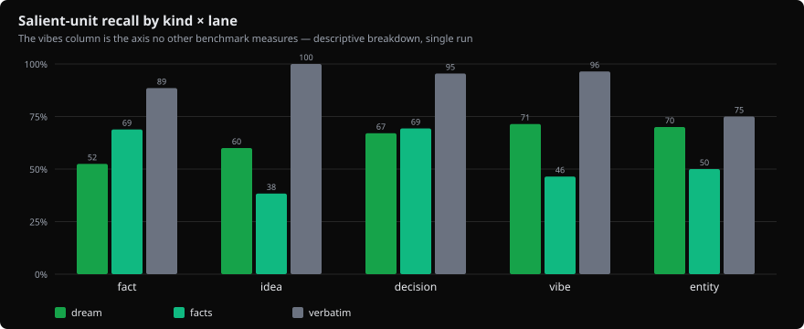

# Cat 35: what survives when a transcript becomes memory?

Corpus dated August 16, 2026. Baseline measured August 25 on gbrain v0.46.3.0; two August 31 runs bracket the changes released in v0.47.8.0.

A two-hour coding session contains many things worth forgetting and a few things worth keeping. Three weeks later, you may need the decision about the database, an idea for a product, or the name of someone you promised to contact. This benchmark asks whether gbrain saves those things accurately in a readable page.

The first run found two clear problems. Four useful transcripts never reached the writer because triage rejected them. And the writer often put paraphrases inside quotation marks. The August 31 changes addressed both: all 20 signal-bearing sessions emitted pages, judged recall rose to 88.1%, and mechanically verified quote fidelity rose to 82.7%.

Human judge calibration is still pending. The published calibration file has 24 coverage pairs awaiting human scores. These results are useful machine-judged evidence, with mechanical checks alongside; they have not passed that human validation step.

## The before-and-after result

The baseline was 62 commits behind master when the fix work began. We therefore ran the then-current master before the changes, then the candidate after them, on the same frozen corpus and judge prompt.

| Metric (dream lane unless noted) | Published v0.46.3.0 (2026-08-25) | Pre-wave master `aa820c7f` | **Post-wave `079941d2` (shipped as v0.47.8.0)** |
|---|---|---|---|
| Salient-unit recall (macro) | 61.5% [45.0–77.6] | 70.2% [53.5–85.6] | **88.1% [82.0–93.5]** |
| Strict (full-credit only) | 56.1% | 64.7% | **82.1%** |
| Sessions emitting pages (of 20 expected) | 16 | 16 | **20** |
| Quote fidelity (mechanical substring) | 45.4% | 54.2% (130/240) | **82.7% (115/139)** |
| Claim hallucination | 14.1% | 14.0% | **7.0%** |
| Distractor leakage | 0% | 1.2% (1/86) | 1.2% (1/86) |
| Usability | 85% | 89.6% | **90.8%** |
| Facts lane (macro) | 60.8% | 58.6% | **64.8%** |
| Verbatim control (judge ceiling) | 93.1% | 93.3% | 93.0% |
| Gates | pass ([recalibrated](#corrections-and-limits)) | pass | pass |
| Measured cost | $6.20 | $6.23 | $6.36 |

The relevant comparison for the change is `aa820c7f` to `079941d2`: 70.2% to 88.1% judged recall, and 16 to 20 sessions emitting pages. The older 61.5% baseline helps show the history but includes intervening changes.

Both August 31 receipts say `gbrain_version: 0.47.7.0` because they preceded the version bump. Their SHAs identify the tested code. The [pre-change receipt](2026-08-16-brainbench-cat35-transcript-distill/receipt-2026-08-31-prewave-baseline-aa820c7f.json) and [post-change receipt](2026-08-16-brainbench-cat35-transcript-distill/receipt-2026-08-31-v0.47.8.0-wave-079941d2.json) record those identities. The release at `2a56b512` added documentation and a response-schema widening; the tested write path was unchanged. The relevant implementation is [gbrain PR 4742](https://github.com/garrytan/gbrain/pull/4742).

## What changed in the writer

Triage normally lets a transcript through at a score of 0.5. The four formerly missed transcripts still scored below that threshold after the changes: 0.45, 0.35, 0.42, and 0.42. They were admitted by a new rescue rule. A score above 0.30 can qualify when the triage model identifies signal-bearing quotations that actually appear in the transcript. The routine controls remained at or below 0.18, and none emitted pages.

This matters because a useful decision can be buried inside logs and routine discussion. Lowering the threshold indiscriminately could save that decision while also admitting noise. The rescue rule uses an additional piece of evidence. On this corpus it recovered the four sessions without triggering the routine controls; larger and repeated tests are still needed.

The writer also began removing quotation marks from text it could not verify as a quote. Verified spans rose from 130/240 to 115/139. The percentage improved partly because there were fewer quoted spans, not because more verbatim quotations were produced. A supported paraphrase without quotation marks is preferable to pretending it is a direct quote.

The facts extractor gained an `idea` kind. Its idea recall rose from the original 38.3% to 50.0%. The dream lane's original-to-post-change recall by kind was fact 52.5→86.1%, decision 67.0→88.6%, idea 60.0→86.7%, entity 70.0→95.0%, and emotional tenor 71.4→87.5%.

Against the immediate pre-change run, 42 of 173 gold items improved and eight regressed; 29 improvements came from the four recovered sessions. These item credits depend on model judgments. They are reproducible recounts of saved verdicts, not deterministic evidence of how another generation or judge run would behave. The verbatim control moved two items up and three down, a reminder that judging itself varies.

## The three ways of saving a session

The verbatim lane imports the transcript and stops. It is a searchable archive, preserving both useful content and noise. The facts lane imports it and extracts short typed statements. The dream lane first judges whether the session contains durable signal, then asks a synthesis agent to write pages.

The dream prompt asks for a self-contained opening, grounded quotations, links into existing content, and no page for routine work. Each transcript gets a fresh PGLite database and a ten-page fictional scaffold so links can point to something. Modified scaffold pages contribute only the added or changed lines to the scored output.

The original baseline used Haiku for triage and Sonnet for synthesis and judging. `runTranscriptsIngest`, `runExtractConversationFactsCore`, and `runPhaseSynthesize` are the production functions called at the original `cc3e2843…` pin. Facts are scored as facts, not as a polished page; their usability column is therefore not applicable.

## What the corpus contains

There are 24 synthetic transcripts: four examples in each of six scenarios. These cover coding with reflection, startup ideas, people and deals, mixed routine work and signal, emotional processing, and purely routine work. One example per scenario is a longer noisy transcript of 10,000–30,000 characters with logs, code, and tool calls.

The fixture plants 173 statements worth preserving, 86 true but routine distractions, and two attribution hazards. One hazard asks whether an agent's proposal is incorrectly recorded as the user's decision. The other concerns a killed process whose completion must not be asserted. Fictional details reduce the usefulness of answering from general knowledge, but they do not remove authoring bias.

Each gold statement has one proposition and a phrase that appears in the transcript. A seeded skeleton and cached Opus-generated prose make the corpus repeatable. Before the full run, an audit found 26/173 statements overstated what their supporting phrases established; those statements were softened. No gold was changed after full-run scores existed.

## How to read the scores

A model judge marks each gold statement fully preserved, partly preserved, or absent, worth 1, 0.5, or 0 points. The headline averages recall within each signal transcript, then across transcripts. The bootstrap interval resamples transcripts; it does not measure repeated model-run variation. Strict recall counts only full credit.

A quoted span must pass a substring check to count as verbatim. Hallucination scoring asks whether a page's claims are supported. The joint dream score multiplies coverage by evidence grounding. A page can mention the right subject yet misstate it, so coverage alone is insufficient.

This approach draws on partial-credit coverage scoring in [SummHay](https://arxiv.org/abs/2407.01370) and operation-level memory evaluation in [HaluMem](https://arxiv.org/html/2511.03506). HaluMem's Table 3 reports 42.91% extraction recall for Mem0 and 41.53% for Supermemory on its Medium corpus. Those are different tasks, data, and judges; they do not establish a win or loss against Cat 35. Emotional-content preservation is also related to [PSentScore](https://arxiv.org/abs/2307.12371). We make no claim that Cat 35 is the first or only benchmark of these broader problems.

## The original August 25 measurements

These tables and charts preserve the first run. The later results above supersede them for the tested newer write path.

| System | Salient-unit recall (1/0.5/0) | Strict | Halluc. | Leakage | Usable | n | Source |
|---|---|---|---|---|---|---|---|
| **gbrain dream (headline)** | **61.5%** [45.0-77.6] | 56.1% | 14.1% | 0% | 85% | 20 signal transcripts | [baseline receipt](./2026-08-16-brainbench-cat35-transcript-distill/baseline-receipt.json) |
| **gbrain facts** | **60.8%** [49.6-71.2] | 51.4% | 3.6% | 0% | n/a (not a page) | 20 | same |
| **gbrain verbatim (control)** | **93.1%** [89.9-96.3] | 86.1% | ≈0 by construction | 100%† | 0% | 20 | same |
| Mem0 (HaluMem-Medium) | 42.9% | — | — | — | — | different corpus | arXiv 2511.03506 — NOT directly comparable |
| Supermemory (HaluMem-Medium) | 41.5% | — | — | — | — | different corpus | arXiv 2511.03506 — NOT directly comparable |


The verbatim control's 93.1% is a measured score on content known to be present, not a universal judge ceiling. Its failure to reach 100% tells us the judge or its coverage protocol can under-credit present material. Dream's original joint coverage-and-grounding score was 51.5%, below its 61.5% coverage alone. Micro averages were within two percentage points of macro averages in this run.

| Kind | verbatim | facts | dream |
|---|---|---|---|
| fact | 88.5% | 68.9% | **52.5%** |
| decision | 95.5% | 69.3% | 67.0% |
| idea | 100% | **38.3%** | 60.0% |
| entity | 75.0% | 50.0% | 70.0% |
| vibe | 96.4% | 46.4% | **71.4%** |

The original dream writer preserved emotional tenor and decisions more often than literal facts. The facts extractor did better on facts and decisions but poorly on ideas. That suggests complementary uses, but a combined-lane benefit was not measured here.

By notability, original dream recall was 62.0% / 63.4% / 57.8% for high / medium / low items; facts recall was 66.3% / 59.8% / 50.0%. By position in the transcript, dream recall was 59.1% early, 65.8% in the middle, and 59.8% late. This sample did not show a middle-position dip; it does not disprove that effect at other lengths or on other data.

Original triage scores averaged 0.666 for expected-signal sessions (minimum 0.32) and 0.118 for routine sessions (maximum 0.15). Thresholds of 0.3, 0.5, and 0.7 would have admitted 100%, 80%, and 65% of signal sessions, with no routine sessions admitted in this sample. This was a descriptive sweep, not an independent validation of a new threshold.

The original decision-attribution hazard passed. The killed-process hazard was in a transcript rejected by triage, so it was unmeasured. An omitted page is not evidence that a writer handled a hazard correctly.




## Corrections and limits

An August 26, 2026 pre-publication erratum found that the first leakage scanner was case-sensitive, while corpus validation accepted case differences. Fourteen of 261 anchors, including three distractions, were invisible to that scan. The saved baseline therefore records verbatim leakage of 83/86 = 96.5%; a corrected mechanical recount is 86/86 = 100%. Dream and facts leakage remained zero in that baseline. The chart retains the old 96.5% label. Both August 31 dream runs recorded one confirmed distraction out of 86, or 1.2%; we have not isolated whether that difference reflects generation, judging, or both.

The original validity threshold required verbatim recall of at least 0.95. After seeing 0.931, it was lowered to 0.90. The baseline receipt correctly keeps `gate_pass: false` under the original rule; the table's later “pass” uses the changed rule. This was a disclosed post-result gate change, not a pre-registered pass.

Judge and writer come from the same model family. Mechanical quote checks provide an independent constraint, but the coverage headline still depends on the judge. The judge prompt did not neutralize document delimiters in these runs. Human calibration of coverage remains unfinished, and usability and emotional-tenor judgments are uncalibrated.

The judge is recorded as the alias `claude-sonnet-4-6`, not an immutable snapshot. Since September 1, receipts also capture server-reported model IDs and suppress cross-run deltas unless both runs resolve to one matching model ID. Even matching server IDs do not prove weights were immutable.

The corpus was frozen before the first full run. The later fixes were informed by its failures, so the same-corpus improvements are regression evidence, not untouched holdout generalization. The baseline used the shipped triage threshold; that narrower fact should not be expanded into “nothing was tuned on this corpus.”

## Cost and reproduction

| Item | Value |
|---|---|
| Full run wall (24 × 3 lanes, dream p-limit 2) | 29 min |
| Full run measured cost — judges + facts extraction | $6.20 |
| Dream-lane synthesis spend | not surfaced by gbrain's phase API (estimated $2-6 additional; see receipt `cost_note`) |
| BPRE smoke | $0.10, 81 s |
| Judge failure rate (published run) | 0.6% ([retry policy](#cost-and-reproduction)) |
| Corpus generation (one-time, now cached) | $6.60 |
| Compression ratio (output/transcript, chars) | verbatim 1.06× · facts 0.15× · dream 0.64× |

The measured $6.20 excludes dream synthesis spend, which the phase API did not expose; the estimate was another $2–$6. The later $6.23 and $6.36 figures have the same accounting limit. The original worst-case preflight estimate was $45, so the run used a $50 cap instead of the $40 default. These are historical costs, not a current price quote.

These are the original commands. Their comment about the “current pin” refers to the report's former v0.47.8.0 dependency. To repeat a historical configuration, check out its recorded SHA; the repository's current dependency has moved.

```bash
git clone https://github.com/garrytan/gbrain-evals && cd gbrain-evals
bun install        # postinstall links the nested pglite path gbrain expects
export ANTHROPIC_API_KEY=... OPENAI_API_KEY=...

bun test test/eval/                                   # $0, no network
bun run eval:cat35:smoke                              # BPRE smoke, measured $0.10 / 81 s
CAT35_HARD_STOP_USD=50 CAT35_JUDGE_MODEL=claude-sonnet-4-6 bun run eval:cat35 # at the current pin this reproduces the 2026-08-31 post-wave receipt ($6.36); the $6.20 / 29 min publication ran at cc3e2843… (v0.46.3.0)
# (eval:cat35 sets CAT35_FULL=1 — full spend; pre-run estimate was $11-18
#  Haiku-judge / $19-28 Sonnet-judge; the batched judges came in far under.
#  CAT35_HARD_STOP_USD=50 was set for the published run because the
#  deliberately pessimistic pre-flight projects $45.)

# Charts from the receipt:
bun eval/runner/cat35-transcript-distill-chart.ts \
  eval/reports/cat35-transcript-distill/<stamp>-cat35.json \
  --out docs/benchmarks/2026-08-16-brainbench-cat35-transcript-distill/
```

The committed fixtures are sufficient to run the benchmark. Regenerating them is optional and changes the work being reproduced; the original one-time generation cost was $6.60, with roughly $6 estimated on a fresh clone and under $1 with its prose cache. Smoke mode uses two transcripts. Full mode requires `CAT35_FULL=1` and passes a worst-case cost check.

At the original pin, ingestion disabled embeddings and fixed the redaction-pattern path. Facts extraction used one worker. Dream calls used a fresh brain per transcript, concurrency two, `max_turns=16`, a 600,000 ms timeout, and zero cooldown. Seed 350001, fixed 45-second timestamps, 1,000 seeded bootstrap draws, a manifest, and a judge prompt version identify the protocol.

Judges receive statements without their anchor phrases. Missing item IDs retry once, then count as judge failures. Ingest failure affects the ingest and facts lanes for that transcript; a dream timeout affects the dream lane. Failed work remains in the denominator. These rules prevent a failure from improving the score by removing a hard example.

The [evidence directory](2026-08-16-brainbench-cat35-transcript-distill/) holds the baseline, paired reruns, charts, and pending `judge-calibration-2026-08-25.json`. The runner is `eval/runner/cat35-transcript-distill.ts`, checks are in `cat35-checks.ts`, and prompts are in `cat35-judges.ts` with version `2026-08-16-v1`. Corpus and manifest are in `eval/data/transcript-distill-v1/`; schemas and tests document the artifact contract.
