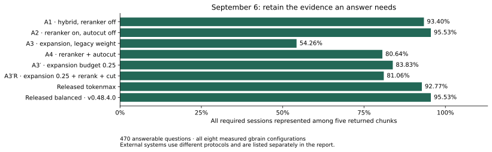
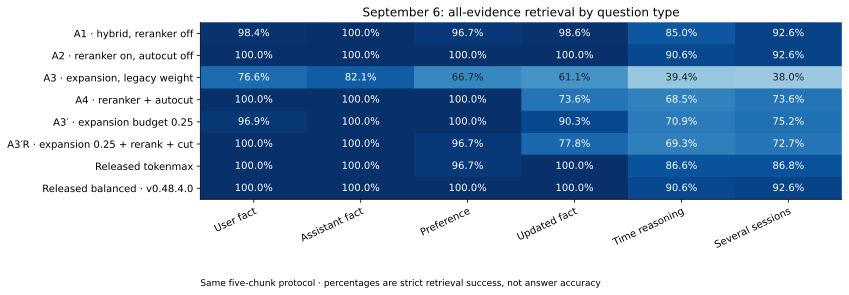

# LongMemEval: why returning more evidence helped

September 6, 2026 · gbrain v0.48.4.0 · released at `2efaaf8f8a817b5b82e023383618fdcdb1cc5f7d`. Receipts were produced on the PR branch headed by `fd7e7fd9`, then squash-merged in [gbrain PR 4946](https://github.com/garrytan/gbrain/pull/4946).

The most useful change was also the simplest: stop throwing away retrieved evidence too early. With reranking on, turning off the final score-based cut raised strict LongMemEval retrieval from 379/470 questions to 449/470. The cut often kept one good conversation and discarded another conversation needed to finish the answer.

Two other lessons came from different fixtures. A text reranker can bury the right answer when that answer comes from a stored graph relationship. And popularity bonuses can push a broadly connected page above the specific concept a user asked for. Gbrain added a way to preserve graph answers and made metadata bonuses conditional on lexical evidence.

The resulting release configuration reached **95.53% strict retrieval success** on 470 answerable questions. Its answering model scored **86.6% accuracy** on all 500 questions. These measure different stages. Good retrieval gives the writer a chance to answer; it does not ensure that the writer takes it.

The [September 9 refresh](2026-09-09-retrieval-refresh.md) adds current checks of the smaller fixtures and fixes a result-order bug in this repository's Cat 13 adapter. The LongMemEval receipts below come from gbrain's own evaluator and remain independently recountable.



The redrawn chart shows all eight gbrain configurations and corrects the release label to v0.48.4.0. External systems with different protocols remain in the comparison table below. The [original generated chart](2026-09-06-longmemeval-ranker-wave/longmemeval/ranker-wave-arms.headline.svg) is preserved; no measured values changed.

## What counts as finding the answer?

[LongMemEval](https://arxiv.org/abs/2410.10813) gives each question a history of conversations and labels the sessions needed to answer it. The [cleaned `_s` dataset](https://huggingface.co/datasets/xiaowu0162/longmemeval-cleaned) has 500 questions. Thirty ask about something never discussed, so retrieval scoring excludes them and uses 470 questions. Answer accuracy includes all 500 because declining to answer is part of that task.

Strict `recall_all@5` gives a question credit only when every required session is represented among the **first five chunk rows** returned. Multiple chunks may come from the same session. This is not five guaranteed distinct sessions. The looser `recall_any@5` gives credit for finding just one required session.

For example, a question about the total time spent jogging and doing yoga may require two sessions. Returning the jogging session alone passes any-hit and fails all-hit. That distinction explains why an apparently excellent any-hit score can conceal an important retrieval failure.

Every arm uses the same dataset file, SHA-256 `d6f21ea9d60a0d56f34a05b609c79c88a451d2ae03597821ea3d5a9678c3a442`, and cached OpenAI `text-embedding-3-large` vectors at 1,536 dimensions. This pins the experiment's embeddings; it is not the current new-install embedding default. Each question gets an isolated corpus in in-memory PGLite, reset between questions.

## The settings we changed

Hybrid search combines keyword matches, vector matches, title matches, and eligible graph results. Rank fusion combines the lists. Later stages can add metadata bonuses, rerank candidate text, protect particular results, or shorten the returned list. More stages do not automatically produce better answers; each needs a test that exercises its behavior.

The experiment used these configurations:

| Arm | Configuration | Purpose |
|---|---|---|
| A1 | balanced, reranker off, autocut off | like-for-like with the 2026-09-02 receipt (parity gate) |
| A2 | balanced, reranker on (voyage:rerank-2.5), autocut off | reranker effect, cross-check |
| A3 | balanced, reranker off, LLM multi-query expansion (variants recorded) | the tokenmax regression reproduced |
| A4 | balanced, reranker on, autocut on (shipped default), pool captured | decision baseline; autocut floor replay source |
| dev sweep | A3 variants replayed at expansion budgets {2.0, 1.0, 0.5, 0.25} on the 40-question dev slice | knob selection (never on the decision set) |
| A3′ / A3′R | chosen budget, reranker off / `tokenmax` with reranker on | mechanism receipt / the configuration tokenmax users run |
| final | all receipted flips applied | release-configuration gate |

A1 is the simple hybrid reference with reranking and autocut off. A2 adds Voyage `rerank-2.5`, scoring up to 25 input candidates. A3 asks Haiku for alternative question phrasings and adds their vector result lists to fusion. A4 adds autocut at floor 0.35 to the reranked search. It was the default before this release, not the current default.

A3′ divides a fixed expansion budget across the alternative lists: each gets `budget / number_of_voting_variants`. With the old policy, every variant got a full vote. A3′R combines the selected budget with the then-current tokenmax bundle, including its old autocut setting.

Forty questions, selected with seed 42, formed the development slice used to choose an expansion budget. Decisions were checked on the remaining 430. The full 470-question score includes that development slice, so the decision column matters when judging a tuned setting.

## The retrieval results

| Arm | recall_all@5 (470) | recall_any@5 (470) | paired vs A1 (470) | recall_all@5 (430 decision set) | paired vs A1 (430) |
|---|---|---|---|---|---|
| A1 hybrid, reranker off, autocut off | **439/470 (93.40%)** | 464/470 (98.72%) | +0 / −0 | 403/430 (93.72%) | +0 / −0 |
| A2 hybrid + reranker (autocut off) | **449/470 (95.53%)** | 469/470 (99.79%) | +18 / −8 | 412/430 (95.81%) | +16 / −7 |
| A3 hybrid + LLM expansion (legacy: weight 1 per variant) | **255/470 (54.26%)** | 399/470 (84.89%) | +3 / −187 | 231/430 (53.72%) | +2 / −174 |
| A4 shipped default BEFORE this wave (reranker on, autocut 0.35) | **379/470 (80.64%)** | 467/470 (99.36%) | +16 / −76 | 344/430 (80.00%) | +14 / −73 |
| A3′ hybrid + expansion at budget 0.25 (reranker off) | **394/470 (83.83%)** | 458/470 (97.45%) | +3 / −48 | 360/430 (83.72%) | +2 / −45 |
| A3′R tokenmax (expansion at 0.25, reranker on, autocut 0.35 as tokenmax shipped it) | **381/470 (81.06%)** | 466/470 (99.15%) | +12 / −10 vs A4 | 347/430 (80.70%) | +12 / −9 vs A4 |
| tokenmax as released by this wave (legacy expansion weight, reranker on, autocut off) | **436/470 (92.77%)** | 468/470 (99.57%) | +2 / −15 vs A2 | 400/430 (93.02%) | +2 / −14 vs A2 |
| **final release configuration** (`balanced`: reranker on, autocut off, relational pin 3, metadata gate lexical) | **449/470 (95.53%)** | 469/470 (99.79%) | +18 / −8 | 412/430 (95.81%) | +16 / −7 |

| Type | n | A1 | A2 = release default | A3 | A4 | A3′ | tokenmax as released |
|---|---|---|---|---|---|---|---|
| knowledge-update | 72 | 71 | 72 | 44 | 53 | 65 | 72 |
| multi-session | 121 | 112 | 112 | 46 | 89 | 91 | 105 |
| single-session-assistant | 56 | 56 | 56 | 46 | 56 | 56 | 56 |
| single-session-preference | 30 | 29 | 30 | 20 | 30 | 30 | 29 |
| single-session-user | 64 | 63 | 64 | 49 | 64 | 62 | 64 |
| temporal-reasoning | 127 | 108 | 115 | 50 | 87 | 90 | 110 |

A1 found every required session on 439/470 questions. The September 2 sibling receipt had 438/470: 469 of 470 per-question outcomes agreed, and both had 464 any-hits. One temporal question changed. The runs did not share an embedding cache, so this is close agreement between two harnesses, not byte-identical parity.

Within this experiment, A1 built the cache, later unexpanded arms reused it without misses, and A3 added embeddings for its newly generated variants. This makes the comparisons less sensitive to changing embeddings.

## Reranking helped, but it was not free of losses

A2 gained 18 strict hits and lost eight relative to A1, for a net gain of ten. Temporal questions improved from 108/127 to 115/127. Multi-session totals stayed at 112/121, but that hides four wins and four losses. An unchanged category total does not mean nothing changed within it.

The reranker is useful when several candidates discuss the same subject and only one contains the requested detail. It only orders candidates it receives; it cannot fix every missing-candidate or insufficient-result-budget problem.

## Autocut removed evidence the question still needed

Turning off autocut while keeping the reranker raised strict hits from 379 to 449 on the full 470. That is 70 gains and zero losses: 23 multi-session, 28 temporal, and 19 knowledge-update questions. On the 430-question decision set, the gain was 68, again with zero losses.

Any-hit also changed, from 467/470 to 469/470. The original report called it unchanged; that was wrong. The much larger strict-score improvement still supports the main explanation: the cut commonly retained one relevant session while discarding another.

One recorded example, question `7024f17c`, used the rewrite “How many hours of jogging and yoga did I do last week?” A2 retained the complete evidence; A4 returned one session and missed part of it. This is a recorded rewrite, not a quotation of the dataset's original question.

The experiment replayed different floors over a captured post-rerank pool:

| floor | recall_all (500 captured rows) | autocut applied | mean returned rows | mean returned est. tokens |
|---|---|---|---|---|
| off | 475 | 0 | 5.00 | 3256 |
| 0.10 / 0.20 / 0.35 | 399 | 365 | 2.49 | 1633 |
| 0.50 | 413 | 307 | 2.88 | 1875 |
| 0.65 | 444 | 187 | 3.67 | 2382 |
| 0.80 | 466 | 91 | 4.33 | 2817 |

This table includes all 500 captured rows, including abstention rows. Its counts are not the 470-question headline denominator. The original replay first checked agreement with all 500 live decisions.

At the old floor, the average returned material fell from five rows and an estimated 3,256 tokens to 2.49 rows and 1,633 tokens. The savings were real. So was the missing evidence. No tested floor came within two strict hits of “off” on either seeded half; even 0.80 lost nine full-set hits, all knowledge-update questions. Balanced and tokenmax therefore changed to autocut off.

A later policy could consider whether different sessions are still needed. That remains a proposal; this experiment does not validate a session-aware replacement.

## Query expansion added plausible distractions

Legacy expansion dropped strict hits from A1's 439 to 255. Alternative phrasings can drift from a personal detail into a general topic, and giving every phrasing a full fusion vote lets that drift dominate the original question.

For `c8c3f81d`, the recorded rewrite was “What brand are my favorite running shoes?” A1 found the complete evidence and A3 did not. More searches did not necessarily mean more useful evidence.

On the frozen 40-question development slice, budgets 2.0, 1.0, 0.5, and 0.25 produced 24, 26, 30, and 34 strict hits. Plain hybrid had 36. Budget 0.25 recovered many failures relative to legacy expansion, but on the decision set it still had 360 hits against plain hybrid's 403, a loss of 43.

The budgeted tokenmax comparison gained three decision-set hits over A4, but both retained the harmful old cut. That narrow comparison did not justify enabling budgeted expansion as a new default. The budget knob shipped for experiments; its default stayed `null`.

Released tokenmax, with legacy expansion, reranking, and autocut off, reached 436/470. Balanced reached 449/470. For this corpus and five-row budget, balanced was the supported choice. Conditional expansion on weak original-query evidence is an idea to test, not a result of this run.

## A graph answer can look irrelevant to a text model

LongMemEval does not exercise graph relationships, so a separate NamedThingBench experiment used 11 entity questions and 39 relationship questions.

| Arm (balanced) | core hit@1 (11) | core hit@3 (11) | graph-relationship hit@1 (39) | graph-relationship hit@3 (39) | paired losses vs reranker off |
|---|---|---|---|---|---|
| reranker off, autocut off | 10/11 | 10/11 | 21/39 | 27/39 | — |
| reranker on | 11/11 | 11/11 | **3/39** | **5/39** | 19 hit@1, 22 hit@3 |
| reranker on + `relational_rerank_pin=3` | 11/11 | 11/11 | 21/39 | 27/39 | 0 hit@1, 0 hit@3 |
| reranker on + pin + autocut on (shipped shape) | 11/11 | 11/11 | 21/39 | 27/39 | 0 hit@1, 0 hit@3 |
| … + `metadata_boost_gate=lexical` | 11/11 | 11/11 | 21/39 | 27/39 | 0 hit@1, 0 hit@3 | (identical)

A text reranker sees page text. A graph can know that fund B invested in a company even if fund B's page never repeats the company name. A page for fund A might mention the company and look more relevant to the text model, while answering the relationship incorrectly.

For a “who invested in acme-co” probe, the recorded correct page `funds/fund-b` fell behind `funds/fund-a` after text reranking. This explains the larger pattern: relationship hit@1 fell from 21/39 to 3/39 when reranking was enabled.

`search.relational_rerank_pin=3` puts up to three graph-derived rows ahead of reranked text rows, preserving their fused order. It restored 21/39 hit@1 and 27/39 hit@3 with no losses relative to reranker-off on this fixture. Entity-core hits improved from 10/11 to 11/11.

The pin preserves evidence produced by the graph path. It does not create missing relationships or verify that existing edges are true. A wrong edge can now be promoted. This small fixture did not measure noisy-graph robustness. The fresh [September 9 checks](2026-09-09-retrieval-refresh.md) keep that limitation visible.

## Why popular pages beat specific concept pages

Cat 13 asks paraphrased questions about 30 concepts. It uses 548 probes: 359 tuning, 181 held-out, and eight mixed probes outside those two columns. Twenty concepts are used for tuning and ten for holdout, with seed 42. All adapters in this wave used Voyage `voyage-4` at 1,024 dimensions.

The historical measurements were:

| Arm | tuning (359 probes) | held-out (181 probes) | held-out P@1 |
|---|---|---|---|
| bare vector (voyage-4) | 59.6 | **60.5** | 65.2 |
| gbrain, reranker off / autocut off (E0-V1) | 50.6 | 53.0 | 48.1 |
| gbrain, shipped default (E0-V4) | 53.9 | 55.8 | 63.5 |
| gbrain + `keyword_arm_confidence_floor=0.6121`, off/off (E2-V1) | 50.8 | 53.0 | 48.1 |
| gbrain + `metadata_boost_gate=lexical`, off/off (E3-V1) | 57.3 | **57.8** | 56.4 |
| gbrain + gate, shipped default (E3-V4) | 56.7 | **57.9** | 65.7 |

These Cat 13 rows have an additional qualification discovered during the documentation refresh. This repository's adapter deduplicated pages by their original scores and then sorted by those scores. Gbrain's reranker and graph/alias pins communicate their final order through the returned array; they do not replace the original score. Sorting again could undo that order. In particular, the old “shipped default” reranker-on rows are not faithful measurements of the final output users received. They also had autocut on, which this release turned off. The [fresh report](2026-09-09-retrieval-refresh.md) uses the corrected adapter and explicit settings.

The original diagnostic still explains a concrete problem. For `c13-00038`, “the concept behind emissions offsets,” a correct concept page ranked first in vector search but second after fusion and metadata bonuses. A company hub received backlink and graph bonuses that the concept page lacked.

The tuning replay matched all 359 live tuning outcomes and located 73 of 105 gaps in vector-only cases where bonuses of roughly 1.03–1.12 promoted hubs. The lexical gate applies metadata boosts only when the candidate pool has strict keyword, title, or relational evidence. It is a pool-level condition, not a promise that each boosted page personally matched those words.

The original off/off gated row rose from 53.0 to 57.8 held-out nDCG@5 and passed its prewritten 57.0 threshold, while remaining below bare vector's 60.5. nDCG rewards putting relevant results early; it is not a percentage of questions answered correctly. The remaining gap needs measurement, not an assumption that one particular arm causes all of it.

The original gate checks reported unchanged outcomes on all 50/50 NamedThingBench questions and 40/40 LongMemEval development questions, plus unchanged BrainBench and retrieval-canary checks. These small fixture checks supported that release decision; they do not establish the absence of regressions on other corpora.

A separate keyword confidence floor at 0.6121 left held-out nDCG unchanged at 53.0. In 83% of probes classified as having a non-gold keyword first result, the keyword arm was actually empty. That weakened the hypothesis the floor was meant to address. It stayed off.

## The remaining temporal misses have several causes

The original temporal paragraph overstated a uniform pattern. The ten inspected misses include a gold session at vector rank 20, a vector-rank-three session pushed to fused rank six, and a question requiring six gold sessions when the budget is five rows. They are not all sessions at vector ranks six through fifteen with unchanged fused ranks.

Splitting a question into clauses helped only one of those ten diagnostic cases, below the experiment's rule for a change. No temporal-specific knob shipped. The measured reranker gain for temporal questions was 108 to 115, not 114 as the old prose stated.

## Finding evidence is different from writing the answer

The release reader answered 433/500 questions correctly: 86.6%, with a question-sampling bootstrap interval of 83.6–89.6%. There were no remaining judge errors or budget skips. Non-abstention accuracy was 404/470 (86.0%); abstention accuracy was 29/30 (96.7%). The pre-registered prediction of at least 92% was missed.

Among the 470 answerable questions, 396 had complete retrieved evidence and a correct answer; 53 had complete evidence and a wrong answer; eight had incomplete labeled evidence and a correct answer; and 13 had incomplete evidence and a wrong answer. The reader converted 396/449 = 88.2% of evidence-complete cases. Many remaining errors occur after retrieval, but retrieval failures have not disappeared.

Per-type answer results were assistant 56/56, user 69/70, knowledge-update 70/78, multi-session 111/133, temporal 107/133, and preference 20/30. Preferences illustrate the distinction: retrieval found complete labeled evidence on 30/30, but the reader answered only 20/30 correctly.

The original external comparison table is preserved as a historical citation snapshot. Its vendor values were not produced by this harness, and readers, judges, prompts, and aggregation differ. Use the [comparison guide](../comparison-systems.md) for attribution and updates, not this table as a leaderboard.

| System | Judged QA accuracy | Reader / judge | Comparable? |
|---|---|---|---|
| **gbrain v0.48.4.0 (this run)** | **86.6% (433/500)** | claude-sonnet-4-6 reader, gpt-4o judge, official prompts | — |
| OMEGA (2026) | 95.4% (self-reported) | undisclosed reader/judge | no — protocol unmatched |
| Mastra | 94.87% | GPT-5-mini reader, own architecture | no — protocol unmatched |
| Mem0 | 93.4% (self-reported) | own reader/judge | no — protocol unmatched |

The reader was `claude-sonnet-4-6` with a 512-token output limit and prompt hash beginning `7d991ff3e789`. The prompt adds an abstention instruction. Context consists of the full text of each distinct session represented by the first five retrieved chunks, subject to a 60,000-character cap per session, in sanitized `<chat_session>` blocks. The question date is supplied. Calling this model name a provider snapshot would overstate its reproducibility.

The judge was `openai:gpt-4o`, using the official question-type prompts, temperature zero, and 16 output tokens. The official ten-token limit was rejected by the API in dry runs. Gold and proposed answers were placed inside an additional data-boundary wrapper. Those prompt and context choices are disclosed protocol differences; “official prompts” does not make the whole run identical to every official or vendor setup.

A dry run also caught a reader context cap of 4,000 characters per session. It caused abstention on 11/25 questions despite a gold session at rank one. The cap was fixed before the published run. This is another reason to distinguish selecting a session from actually showing its evidence to the reader.

## What can be verified from the committed evidence

The compacted NDJSON files retain question IDs, retrieved session IDs, retrieval verdicts, and saved answer judgments. The September 9 audit independently recalculated retrieval metrics across all 13 stored arms, including development replays, with zero mismatches. It can also recount the 433 saved correct-answer flags.

The compacted files do not preserve answer hypotheses, full reader configuration/context fields, raw judge responses, or captured reranker pools. They cannot independently rejudge answer quality or recreate the original autocut replay from candidates. The original replay report remains historical evidence for that analysis. A fresh answer run or pool experiment must save those missing materials.



The chart source is `longmemeval/ranker-wave-arms.json`, converted from harness receipts by `harness-to-runner-output.py` and rendered by `eval/runner/longmemeval-chart.ts`.

## Time, cost, and reproduction

| Arm | mean wall / question | arm wall |
|---|---|---|
| gbrain-hybrid (A1: reranker off, autocut off) | 15.0 s | 7505 s |
| gbrain-hybrid+rerank (A2: autocut off) | 4.8 s | 2401 s |
| gbrain-hybrid+expansion (A3: legacy weight) | 5.9 s | 2974 s |
| gbrain-hybrid+rerank+autocut (A4: pre-wave default) | 3.8 s | 1909 s |
| gbrain-hybrid+expansion@0.25 (A3') | 8.2 s | 4117 s |
| gbrain-hybrid tokenmax+rerank+autocut, expansion@0.25 (A3'R) | 4.8 s | 2421 s |
| gbrain-hybrid tokenmax as released (legacy expansion, rerank, no autocut) | 4.8 s | 2417 s |
| gbrain-hybrid release default v0.48.4.0 (rerank on, autocut off, pin 3, gate lexical) | 4.8 s | 2403 s |

These figures divide total benchmark wall time by questions. A1 built the cache; later arms reused it. They include setup and ingestion, so they do not show that adding a reranker makes ordinary search three times faster. Per-query search latency percentiles were not saved.

The historical estimate was about $55 actual spend and $60 booked against a $75 cap. Components were roughly $2 to build embeddings, $0.50 per reranked arm, $1 for expansion variants, $3 for Cat 13 and NamedThingBench, and $30 for reader/judge work including dry runs and failed partial passes. The ledger booked launch estimates, so these are estimates, not a reconciled provider bill or current prices.

These original commands establish the experiment shape. Pin gbrain and verify the dataset hash before comparing results; use the [refresh report](2026-09-09-retrieval-refresh.md) for the corrected smaller-fixture runners.

```bash
mkdir -p ~/datasets/longmemeval && curl -Lo ~/datasets/longmemeval/longmemeval_s_cleaned.json \
  https://huggingface.co/datasets/xiaowu0162/longmemeval-cleaned/resolve/main/longmemeval_s_cleaned.json
export OPENAI_API_KEY=… VOYAGE_API_KEY=… GBRAIN_EMBEDDING_MODEL=openai:text-embedding-3-large GBRAIN_EMBEDDING_DIMENSIONS=1536
DS=~/datasets/longmemeval/longmemeval_s_cleaned.json
COMMON="--retrieval-only --top-k 5 --by-type --no-trajectory --embed-cache ~/.cache/gbrain-eval/longmemeval-embed.sqlite"
gbrain eval longmemeval $DS $COMMON --mode balanced --reranker off --autocut off --output A1.ndjson
gbrain eval longmemeval $DS $COMMON --mode balanced --reranker on  --autocut off --output A2.ndjson
gbrain eval longmemeval $DS $COMMON --mode balanced --reranker off --autocut off --expansion --output A3.ndjson
gbrain eval longmemeval $DS $COMMON --mode balanced --reranker on  --autocut on --capture-pool --output A4.ndjson
# Cat 13 (this repo; CAT13_EMBEDDING_MODEL=voyage:voyage-4 CAT13_EMBED_DIMS=1024): bun eval/runner/cat13-conceptual.ts --reranker off --autocut off --search-pin search.metadata_boost_gate=lexical   # E3-V1; E3-V4 = --reranker on --autocut on
# NamedThingBench R1 (gbrain repo): bun run scripts/r1-namedthing-rerank-ab.ts --autocut on --relational-pin 3
```

The release settings supported by this evidence are balanced mode, reranker on, autocut off, relational pin three, and lexical metadata gating. Expansion budgeting and keyword confidence remain optional, disabled controls. These are measured defaults for the tested workloads, not guarantees for every corpus. The [settings guide](../settings.md) explains when to consider a different result budget or source policy.
