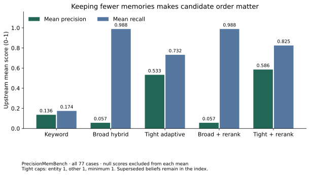
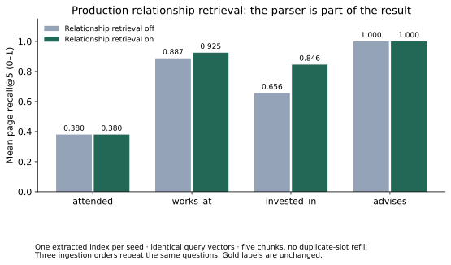
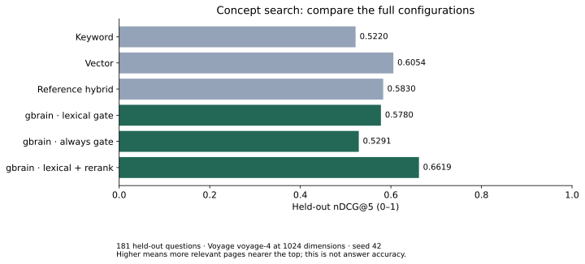

# What to turn on, and why

*September 9, 2026. gbrain v0.48.4.0, commit `2efaaf8f8a817b5b82e023383618fdcdb1cc5f7d`.*

A retrieval system makes several decisions before an agent sees an answer. It
chooses candidates, puts them in order, and decides how many to return. Improving
one of those decisions can make another worse. This experiment separates them.

The case for evaluating gbrain is strongest when you need to make those decisions
explicit. Its measured conversation retrieval is strong. Its tighter retrieval
settings offer a useful precision tradeoff. Its relationship and source controls
can be inspected and tested against the simpler alternatives.

This report includes the complete planned matrix, including losses. The
[readable tables](2026-09-09-retrieval-refresh/tables.md) show every template and
paired comparison. The [machine-readable summary](2026-09-09-retrieval-refresh/summary.json)
links to the saved receipts and lists the question IDs behind gains and losses.

## First, keep evidence that a question needs

Suppose an agent must recall a decision made in one conversation and revised in
another. Returning the first conversation is useful, but insufficient. This is
why we distinguish **any-evidence retrieval**, which finds at least one labeled
conversation, from **all-evidence retrieval**, which finds every labeled
conversation needed for the answer.

We reused the September 6 LongMemEval records. The final balanced configuration
retrieved all labeled conversations on **449/470 answerable questions (95.53%)**,
and at least one on **469/470 (99.79%)**. Disabling autocut, a rule that trims the
list after a large score drop, raised complete retrieval from 379 to 449 questions.
There were 70 paired gains and no losses in that comparison.

That is a reason to evaluate gbrain for long conversation histories. It is also a
reason to keep autocut off when an answer may need several pieces of evidence.
The result is about a particular five-chunk retrieval protocol, not every possible
reading budget. [Full method and historical runs](2026-09-06-longmemeval-ranker-wave.md).

The saved answer judgments count **433/500 correct answers (86.6%)**. This is a
different denominator: it includes 30 questions that should be declined. We
recounted all 13 saved retrieval arms and the stored judgment booleans without
paid model calls. The compacted judgment rows omit the actual answers and raw
judge output, so they support recounting scores but do **not** support independent
re-judging. [Verification record](2026-09-09-retrieval-refresh/longmemeval-verification.json).

## Sometimes the best improvement is returning less

PrecisionMemBench asks for small memories: an entity, a scoped belief, a current
decision. Returning almost everything can find the right fact and still make the
agent's job harder.

We kept all 77 cases and every supplied answer key. Old beliefs remained present
when a newer belief superseded them; the benchmark did not delete inconvenient
memories during setup. We compared broad hybrid retrieval with an adaptive policy
that keeps at most one search result, whether it classifies the query as an entity
lookup or another kind of question. It keeps one when candidates exist.
Reranking re-reads candidates and changes their order before that policy chooses
what to keep.

| Configuration | Mean precision | Mean recall | All case assertions passed | Active retrieval passes |
|---|---:|---:|---:|---:|
| Keyword control | 0.1361 | 0.1744 | 34/77 | 5 |
| Broad hybrid | 0.0565 | 0.9884 | 7/77 | 0 |
| Tight adaptive | 0.5333 | 0.7320 | 38/77 | 25 |
| Broad hybrid + reranking | 0.0565 | 0.9884 | 7/77 | 0 |
| Tight adaptive + reranking | 0.5859 | 0.8250 | 41/77 | 29 |



**Precision** asks what fraction of retrieved memories were relevant. **Recall**
asks what fraction of the needed memories were retrieved. These are upstream
mean scores, not fractions of 77 passing cases. Recall has 43 non-null cases in
each arm. Precision has 49, 70, 65, 70, and 66, respectively. Cases without a
defined score are excluded from that mean. Full-case pass counts include
structural checks and trivially empty results; the last column counts only
active retrieval passes.

Reranking changes the broad configuration's order and some returned memory IDs,
but every case keeps the same precision and recall score. Swapping one irrelevant
memory for another cannot improve either score. Once the return policy keeps
fewer results, order matters: reranking improves tight retrieval
from 0.5333 to 0.5859 precision and from 0.7320 to 0.8250 recall.

The tradeoff is real. The tight policy still misses needed memories that broad
retrieval finds. An alias question that expects both Kubernetes and a CI system
can require more than one entity. Start with tight adaptive retrieval for short
fact lookups where extra material is expensive, then test questions that need
several facts before adopting it. It is not a replacement for the broader
conversation configuration above.

Both reranked arms actually reranked all 72 searches. Five cases exercise paths
that do not call hybrid search. The per-case records retain returned memory IDs,
scorer assertions, and search observations. The
[category and paired tables](2026-09-09-retrieval-refresh/tables.md#precisionmembench-by-category)
include failures in type routing, supersession, and relationship expansion.

## A source preference is a choice about trust

Imagine a short note that contains your final view and a long chat in which you
were thinking aloud. Both mention the same phrase. If the short note is the
better authority, a source preference can express that.

The source-swamp fixture contains ten curated pages and ten longer chat pages.
Its 30 questions deliberately label the curated pages as correct. We ran all
five adapters, including the same gbrain pipeline with source weights enabled
and neutralized.

The active source factors were `1.5` for `originals/` and `0.5` for
`openclaw/chat/`. The off arm neutralized every resolved prefix to `1.0`.
Reranking, expansion, autocut, and query caching were off in both hybrid paths;
both used lexical gating and OpenAI embeddings at 1536 dimensions.

| Adapter | Curated page first | Curated page in first three |
|---|---:|---:|
| Vector only | 29/30 | 30/30 |
| gbrain | 27/30 | 30/30 |
| Reference hybrid | 27/30 | 30/30 |
| gbrain, source boost off | 26/30 | 30/30 |
| Keyword ranker | 24/30 | 29/30 |

The clean source-boost comparison is 26 to 27 top-1 hits: **one gain, no losses**.
It changed the order on 23 questions without changing most top-1 outcomes.
Vector search alone led this fixture. The experiment supports testing source
preferences when your application has a known trust hierarchy; it does not
support a general claim that hybrid retrieval beats vectors.

The changed question, `q24`, searches for “vertical SaaS marine logistics dental.”
With neutral weights, a chat page comes first and the curated essay comes second.
The source preference moves the essay first. It does not discover new evidence;
it decides which of two matching sources should be read first.

The prefix map matters. A preference for `openclaw/chat/` has no effect on files
stored under another prefix. The receipts record the resolved map and the neutral
weights used by the off arm. A prior historical adapter comparison changed more
than source weights, so its gap was not the isolated effect of source boosting.

## Keep the historical relationship adapter separate

The existing comparison has an adapter named `gbrain` that recognizes four
question templates and follows the fixture's graph. It is a useful specialized
system. It is different from the production hybrid pipeline exercised below.

We ran all four existing adapters, over their applicable question families, with
three ingestion orders. The specialized adapter handles relationship questions;
it is not included in fuzzy or externally authored families it cannot answer.

| Family | Adapter | Mean P@5 | Mean R@5 |
|---|---|---:|---:|
| Relationships | Specialized `gbrain` | 0.3421 | 0.9791 |
| Relationships | Reference hybrid | 0.1917 | 0.6874 |
| Relationships | Keyword ranker | 0.1710 | 0.6244 |
| Relationships | Vector only | 0.1076 | 0.4069 |
| Fuzzy | Reference hybrid | 0.1167 | 0.5833 |
| Fuzzy | Keyword ranker | 0.1583 | 0.7917 |
| Fuzzy | Vector only | 0.1167 | 0.5833 |
| Externally authored | Reference hybrid | 0.1957 | 0.8404 |
| Externally authored | Keyword ranker | 0.1957 | 0.8511 |
| Externally authored | Vector only | 0.2085 | 0.8936 |

The 145 relationship, 24 fuzzy, and 47 externally authored questions have
nonempty relevance labels. The existing scorer excludes 0, 6, and 3 empty-label
questions, respectively; their inputs remain unchanged. The receipt counts 793
applicable adapter/question combinations. Each has three saved repetitions,
for 2,379 scored queries. The repeats check ingestion-order sensitivity, not
independent samples of new questions. Scores did not materially vary by seed.

The specialized graph path is strong on the templates it understands. The
reference hybrid, keyword, and vector paths win different comparisons. The
specialized adapter's advantage is a comparison between whole systems. It does
not establish that “graph alone added 31 points.” Older precision headlines also
used metric helpers corrected in the repository audit; use the fixed-denominator
P@5 values above for this run.

## Production relationship retrieval: one switch

The controlled experiment shares one extracted index per seed and identical query
vectors between its off and on calls. Both calls use the same metadata settings.
Only `search.relational_retrieval` changes. Depth is two. Each call requests five
chunks. We retain their returned order, count each page once, and do not refill
slots lost to duplicate pages.

Reranking, expansion, autocut, and query caching are all off. Both arms use OpenAI
`text-embedding-3-large` at 1536 dimensions, balanced mode, and lexical metadata
gating. This is separate from the historical reranker-pin repair.

This isolates the effect of the production relationship stage under those
settings. It does not compare graph database products. A graph database stores
pages and links; traversal uses those links to find an answer.

| Question template | Questions per seed | Relationship off: R@5 | Relationship on: R@5 | Mean first-place hit rate, off → on |
|---|---:|---:|---:|---:|
| Who attended X? | 50 | 0.3800 | 0.3800 | 0.0000 → 0.0000 |
| Who works at X? | 40 | 0.8875 | 0.9250 | 0.1167 → 0.1167 |
| Who invested in X? | 39 | 0.6560 | 0.8462 | 0.2308 → 0.5385 |
| Who advises X? | 16 | 1.0000 | 1.0000 | 0.4375 → 0.5625 |
| All templates | 145 | 0.6626 | 0.7241 | 0.1425 → 0.2391 |

Across the 435 question/seed pairs, enabling relationship retrieval improved
recall on **45 and worsened none**. The same 15 questions gained in each seed.
First-place hits improved on 42 pairs. The three orders repeat the same questions;
they are not 435 independent samples.

The largest benefit was on investor questions: first-place hits rose from 9/39
to 21/39 in every seed. Following an `invested_in` link can promote investor pages
over pages that merely mention the company. Attendance
did not improve at all. All 145 questions matched a supported question pattern.
Per seed, 47 produced relationship candidates, 83 resolved the named page but
found no matching candidates, and 15 could not resolve the named page. Recognizing
the wording was not enough: the named page and the right link also had to be found.

For `q-0099`, “Who invested in Drift?”, ordinary retrieval found three of the four
labeled investor pages but put a different person first. Relationship retrieval
added Fiona Moore's page and placed it first. Recall rose from 3/4 to 4/4. A typed
link brought the requested people into the reading budget.

The answer key rewards person pages. A company or meeting page can contain the
same facts and still receive no relevance credit. The ordinary result list for
Drift included its company page. These are gains in finding the labeled pages,
not measured gains in answer accuracy; no answering model was run for this cell.



Both arms returned exactly five chunks. Those represented an average of 4.743
pages with the stage off and 4.660 with it on. We did not compensate for repeated
pages by asking for more chunks. R@5 divides each question's distinct relevant
pages found by its labeled relevant-page count. P@5 keeps a denominator of five.
The receipt records all 870 calls, with no execution failures.

The parser is part of the system being measured. For “Who attended X?”, the
fixture reads `meeting → person` attendance links; production expects
`person → meeting`. For employment, production follows `works_at` links, while
the fixture's answer keys also accept founders. We keep those cases and answer keys intact. A
parser mismatch is a measured workload limitation, not permission to remove a
question. Search execution failures are marked separately from ordinary misses.

## Concept search: order, meaning, and popularity

A concept question may use different words from the page it needs. Vectors help
bridge that gap. But another page may be popular or well connected. Metadata
bonuses should not automatically let that popularity overwhelm a good meaning
match.

We used the existing concept split: 20 concepts for tuning and ten held out, seed
42. The target of 500 probes produces 548 actual questions: 359 tuning, 181 held
out, and eight mixed. All questions appear in the overall score; mixed questions
appear in neither split score. We did not change the split or answer keys.

The four baseline adapters use Voyage `voyage-4` at 1024 dimensions. Reranking and
autocut are off. Both hybrid adapters use lexical metadata gating. Two additional
gbrain cells change only the gate to `always`, or turn reranking on with autocut
off. Lexical gating applies to the whole candidate pool: a keyword, title, or
relationship contribution permits metadata bonuses; a vector-only pool skips them.

The concept arms build their own indexes and make their own embedding calls.
They share the fixture, seed, model, and dimensions; they do not share exact
vectors as the relationship A/B does. The confirmation run moved a few aggregate
scores slightly. The table below uses the selected valid attempts throughout.

Here, **nDCG@5** rewards placing more relevant pages nearer the top. The exact
target has grade three; a related co-occurrence page has grade one. **Strict
top-1** asks whether the first page is an exact target. These measure different
things from binary recall.

| Configuration | All 548: nDCG@5 | Held-out 181: nDCG@5 | Held-out exact target first |
|---|---:|---:|---:|
| Keyword ranker | 0.5085 | 0.5220 | 101/181 |
| Vector only | 0.5954 | 0.6054 | 118/181 |
| Reference hybrid, lexical gate | 0.5770 | 0.5830 | 102/181 |
| gbrain, lexical gate | 0.5713 | 0.5780 | 102/181 |
| gbrain, always apply metadata | 0.5074 | 0.5291 | 87/181 |
| gbrain, lexical gate + reranking | 0.6381 | 0.6619 | 130/181 |



The complete reranked gbrain configuration leads this comparison. Without
reranking, vector search leads both hybrid configurations. That is useful guidance
for builders with concept questions: evaluate the lexical gate and reranker
together, and include vector search as a serious alternative when the extra
reranking call does not fit your latency or cost budget.

Lexical gating helps too. Its held-out score is 0.5780, versus 0.5291 when metadata
bonuses are always permitted. A page's popularity is useful only when it supports
the retrieval task. Reranking then raises the lexical-gated score to 0.6619.
All 548 queries in the reranked arm have observed reranker scores and no execution
failures.

The two single-adapter receipts retain the generic runner's `verdict: partial`
and `publishable: false` flags. That runner calls any adapter subset partial.
Each of these planned cells asks for gbrain alone; the matrix validator requires
all 548 questions for that adapter and records the cell as complete. Neither
cell substitutes a sample of questions for the full fixture.

The average improvement does not mean every question improved. These paired
counts compare the same 181 held-out questions with lexical-gated gbrain:

| Change from lexical-gated gbrain | nDCG gains | Losses | Ties |
|---|---:|---:|---:|
| Turn reranking on | 77 | 32 | 72 |
| Always apply metadata bonuses | 1 | 37 | 143 |
| Use vector search alone | 45 | 30 | 106 |

Reranking puts an exact target first on 37 previously unsuccessful questions,
but loses that position on nine others. The net gain is 28, from 102/181 to
130/181. Inspecting those nine losses is part of evaluating the setting, even
when the overall result is favorable.

The [template tables](2026-09-09-retrieval-refresh/tables.md#concept-search-by-template)
include copied phrases, synonyms, paraphrases, and neighborhood questions for
all six configurations and both splits. These are 181 held-out questions about
ten held-out concepts on a synthetic corpus. They support an evaluation starting
point, not a claim about every domain or independent replication on a new corpus.

## What changed in the harness

Both hybrid adapters previously sorted pages by the original search score after
gbrain had returned them. That could undo reranking or move a deliberately
preserved relationship answer out of position. They now keep gbrain's returned
order and deduplicate by first occurrence. The controlled relationship test also
checks the five-chunk limit and duplicate-slot behavior.

The affected runners record explicit embedding models and dimensions, reranking,
expansion, autocut, caching, metadata gating, adaptive caps, and the settings read
back from each adapter. Search observations distinguish a requested feature from
a feature that ran. Unexpected embedding or reranking fallback makes a fixed
cell invalid. An ordinary empty result or wrong page remains a measured outcome.

Precision's adaptive policy is a query-level override. Its receipt therefore
keeps the engine baseline `search.adaptive_return=false` and separately records
the active query option in `resolved_config.adaptive_return`. The pinned public
API exposes search and relationship diagnostics, but not every internal graph
metadata failure. We do not claim the receipts observe that unexposed stage.

No gbrain production API, dependency pin, dataset, question, answer key, or tested
prompt was changed. We added benchmark options and observations through the
existing adapter and receipt interfaces.

Shipping review subsequently tightened failed-run receipts, relationship
completeness checks, interrupted-request accounting, and report-path handling
for a checkout in a different directory. These changes do not alter successful
search rankings. The [archived harness source](2026-09-09-retrieval-refresh/harness-source.json)
preserves the exact 17 files behind the fingerprint recorded for the eight
confirmation attempts; the original receipts and launch hashes remain intact.

The [validation record](2026-09-09-retrieval-refresh/validation.json) records the
tests, data checks, document checks, and separate editorial review. It also
distinguishes the passing repository typecheck from existing diagnostics inside
the pinned dependency.

## Reproduce a cell, or the whole matrix

Install the pinned dependencies with `bun install --frozen-lockfile`. The wrapper
and reporting scripts use Python 3.9 or later. The paid
matrix needs `OPENAI_API_KEY` and `VOYAGE_API_KEY`. Set them in your environment;
do not put them in a report or command history you intend to publish.

```sh
# A short paid comparison: all 77 cases, tight caps, with reranking.
python3 scripts/run-retrieval-refresh.py \
  --cells precision-adaptive-rerank \
  --output-dir eval/reports/my-retrieval-check --api-budget 25

# The complete fixed matrix, with a shared aggregate ceiling.
python3 scripts/run-retrieval-refresh.py \
  --output-dir eval/reports/my-retrieval-matrix --api-budget 1000

# Recount the committed historical retrieval records without model calls.
python3 scripts/verify-published-longmemeval.py

# Rebuild this report's comparison data from committed attempts.
python3 scripts/summarize-retrieval-refresh.py

# Check protected input/evidence bytes, prompt fences, links, and anchors.
python3 scripts/verify-documentation-refresh.py
```

To redraw the standalone SVG figures, install Matplotlib in your Python
environment and run `python3 scripts/plot-retrieval-refresh.py`. The charts read
the saved summary; they do not call a model or choose different benchmark rows.
`python3 scripts/correct-historical-chart-labels.py` redraws the historical
gbrain figures with readable labels and their original measured values. The
original charts remain available, and unmatched external protocols stay in the
comparison tables.

The wrapper runs one cell at a time by default. Add `--jobs 2` or `--jobs 3`
to run cells concurrently under the same aggregate budget. Its tight precision
cells pass `--entity-max 1 --other-max 1 --min-keep 1` to the runner: the first
two flags cap results by query type, and the third keeps at least one result
when candidates exist.

Every invocation creates a new attempt directory. A process lock protects the
shared budget ledger. Before each cell, the wrapper reserves $25 against the
aggregate ceiling. Before each API request, including retries, a preload checks
a conservative byte-based cost bound against that cell's reservation. Unknown
models or unpriced endpoints are refused. Reservations are not refunded after
failed attempts. A quality gate can fail on valid evidence; missing receipts,
skipped cells, and execution errors cannot pass as completed experiments.

The full matrix used **19 cell attempts and 12,835 API requests**, including
retries. Recorded usage gives a gross estimate of **$0.7133**. The conservative
request-cost bound totals **$4.7939**, including two failed network requests for
which no provider usage was returned. The wrapper reserved **$475** of the
authorized **$1,000** ceiling. A reservation is a spending limit, not a charge.

Eight initial attempts lacked the complete search observations required by the
final publication checks. We retained them and repeated those cells after adding
the missing instrumentation. The summary selects the latest complete, valid
attempt for each of the eleven cells; it never selects by score. The eight
confirmation attempts ran with at most three cells in parallel. Their times
therefore also reflect resource sharing.

The [budget ledger](2026-09-09-retrieval-refresh/budget-ledger.json) and each
attempt's `usage.ndjson` retain request counts, usage, and cost estimates. Prices
were checked on September 9 against [OpenAI's model documentation](https://developers.openai.com/api/docs/models/text-embedding-3-large)
and [Voyage's pricing](https://docs.voyageai.com/docs/pricing).
These are gross estimates before credits, not invoices. Times in receipts include
the stages named by that runner and should not be read as production latency.

To evaluate your own workload, start with the
[settings guide](../settings.md) and the existing
[query and adapter workflow](../../eval/CONTRIBUTING.md). Choose the questions and
needed evidence first. Compare simple search with gbrain, inspect both gains and
losses, and reserve questions you have not used to choose settings.
