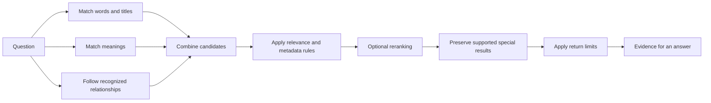

# What we learned about retrieval

A useful memory system has to find what you meant from what you actually wrote.
Those can be quite different things. You might ask for “the person who invested
in Acme,” while the relevant page is a fund's profile. You might remember “the
emissions thing,” while the note is titled “Carbon Credits.”

This is a good reason to evaluate gbrain. It puts several ways of finding
information in one system and lets you inspect how they interact. Its strongest
published conversation-retrieval run found all the labeled evidence for
449/470 answerable questions. The interesting engineering question is how it gets
there, and which parts help on other kinds of material.
[Conversation results](benchmarks/2026-09-06-longmemeval-ranker-wave.md).

## Three ways to find a page

**Word search asks whether the document uses the words in the question.** If you
remember a project code, an unusual phrase, or a person's exact name, this is an
excellent starting point. You can inspect the matching text and see why it matched.

The adapter called `grep-only` in this repository is an in-memory **BM25 keyword
ranker**. BM25 gives more weight to informative matches, taking word frequency and
document length into account. It is more useful as a ranked-search baseline than
a list of unranked matches. It does not invoke the shell command `grep` or `rg`.
The name is a historical identifier, not a description of a Unix subprocess.

**Vector search asks whether the document has a similar meaning.** An embedding
model turns text into a list of numbers, called a vector. Nearby vectors are meant
to represent related meanings. “Emissions offsets” can therefore find “Carbon
Credits” even without an exact phrase match. This is why vectors help with vague
recollections and synonyms. They can also find a nearby topic that does not answer
the question.

**Relationship search follows stored connections.** A graph is a collection of
things and the links between them. A typed link says what a connection means:
“works at,” “invested in,” or “attended.” The direction matters. A company can have
many investors; an investor can have many companies.

The graph is a way of representing evidence. A graph database is a database
specialized for storing or querying that representation. gbrain stores its links
in its database index, using Postgres or embedded PGLite. These experiments test
retrieval behavior. They do not compare database products or prove that a graph
database is universally better than a vector index.

## What happens when you combine them?

A hybrid search uses several methods for one question. gbrain can collect results
from words, vectors, titles, and recognized relationship questions, then combine
them into a list.

**Reciprocal rank fusion**, or RRF, is one way to combine lists. Think of each
method as voting for its top results. A high position gets a stronger vote than a
low position. A page that appears in several lists can move up. This avoids
pretending that a keyword score and a vector similarity score use the same scale.

That is only the beginning. gbrain can also prefer a particular source, use page
metadata, rerank the candidates, or limit how much text comes back. Here is the
pipeline in broad terms; the exact stages depend on the query and configuration:

More stages create more opportunities to help and more ways to disturb a good
result. The experiments below show why configuration is part of retrieval quality.

## Exact phrases and paraphrases are different workloads

Imagine two questions: “Find the note containing ‘server budget for winter’,” and
“What was the plan for paying for more compute?” The first practically hands word
search its target. The second needs a connection between different wording.

Our concept benchmark makes this difference visible. Some probes reuse phrases
from page bodies. Others use synonyms or indirect descriptions. The September
experiments found stronger keyword results on copied body phrases and stronger
vector results on synonym questions. Read the per-template rows in the
[fresh concept comparison](benchmarks/2026-09-09-retrieval-refresh.md), rather than
assuming one overall score settles both questions.

For builders, the lesson is to include both kinds of questions in an evaluation.
A benchmark made entirely of copied phrases can underestimate the value of
semantic retrieval. A benchmark made entirely of paraphrases can miss the
importance of exact names and identifiers.

## A popular page can be the wrong page

A page with many incoming links may be useful. That does not mean it answers the
current question. In a saved concept probe, “the concept behind emissions
offsets,” vector search put the target concept first. Additional link-related
bonuses promoted a company page above it.

A **metadata boost** is a ranking bonus based on facts about a page, such as its
links or age. A **gate** decides when that bonus is allowed. gbrain's lexical gate
skips these bonuses when every candidate came from vector search. If keyword,
title, or relationship search also contributed, the bonuses may still apply to
the result list. The gate acts on the pool, not on each page independently.

The September 6 controlled gate change improved held-out concept nDCG@5 from
53.0 to 57.8 on a 0–100 display scale; bare vector search scored 60.5. That was a
useful improvement with a remaining gap. The new
[refresh](benchmarks/2026-09-09-retrieval-refresh.md) repeats the comparison after
fixing adapter ordering. Adding reranking with the lexical gate reached 66.2 on
the same held-out score scale. That is a reason to test the complete configuration
for concept questions, including both its extra model call and its ranking gains.
The historical
[localization record](benchmarks/2026-09-06-longmemeval-ranker-wave/cat13/E1-localize/localize.md)
shows the individual ranking changes.

## A text reranker can lose an answer found through a relationship

A **reranker** takes a short list of candidate passages and reads each one with
the question to decide which comes first. This can help distinguish two similar
meeting notes when only one answers the question.

But the text of an investor's page may not mention the company in your question.
The answer may be established by a link from another page. In the saved
“who invested in acme-co” case, the graph found `funds/fund-b`; the text reranker
preferred `funds/fund-a`. The relational pin restored the correct first result.

A **relational pin** preserves a bounded number of relationship-derived results
near the top after text reranking. In the September fixture it restored
first-place relationship hits from 3/39 to 21/39. This is evidence for preserving
a useful kind of evidence through a later stage. It is not a clean graph-versus-
vector comparison. [Ranking experiment](benchmarks/2026-09-06-longmemeval-ranker-wave.md).

The [new controlled relationship experiment](benchmarks/2026-09-09-retrieval-refresh.md)
asks a different question: what changes when production relationship retrieval is
switched on while the index and query vectors stay the same? It improved recall
on 15 of 145 questions and worsened none, with the same gains in three ingestion
orders. For investor questions, first-place hits rose from 9/39 to 21/39.

The test also keeps cases that the parser handles differently from the old
specialized wrapper. Attendance questions did not improve: the fixture stores
`meeting → person` links, while the product expects `person → meeting`. A graph
helps when the question and the meaning of the stored links agree.

## Returning less can remove necessary evidence

Suppose you ask how your exercise routine changed between spring and summer.
One conversation describes spring. Another describes summer. The first result can
be excellent while the second is still indispensable.

**Autocut** looks for a large drop between adjacent result scores and discards the
lower-scoring tail. This can save tokens, the pieces of text a model reads. On
LongMemEval it often removed another conversation needed for the answer.
Turning it off raised complete retrieval from 379/470 to 449/470, with 70 gains
and no losses in that comparison. The strict metric exposed a problem that
finding any one relevant conversation largely concealed.

This does not mean every query should return a long list. **Adaptive return
sizing** applies a different idea: choose a result cap based on the kind of query.
A question asking for one preference may want a short answer. An enumeration
needs breadth. Our [precision experiments](benchmarks/2026-09-09-retrieval-refresh.md)
measure that tradeoff with all the same beliefs present, including outdated ones.
Autocut and adaptive sizing are separate controls.

## Extra phrasings can outvote a good question

**Query expansion** asks a language model to generate alternative phrasings of
the question. It is a plausible way to find material written in different words.
It also gives the alternatives influence over the final ranking.

On September 6 LongMemEval, plain hybrid retrieval found all the required
conversations for 439/470 questions. Giving each expanded variant a full vote
reduced that to 255/470. Restricting the variants' combined weight to 0.25 recovered
394/470, still below plain hybrid. The released `tokenmax` configuration, which
also used reranking, reached 436/470; `balanced` reached 449/470.

The lesson is about this small result budget and this corpus. Extra rewrites can
crowd out the original query's best evidence. Start with expansion off for this
workload. If you enable it elsewhere, compare questions where the original query
is weak and count losses as well as gains.
[Full experiment](benchmarks/2026-09-06-longmemeval-ranker-wave.md).

## What the scores mean

Take a question with two relevant pages, A and B. Suppose the first five result
slots contain A, C, D, E, and F:

| Measure | This example | What it tells you |
|---|---|---|
| Precision@5 | 1/5 = 20% | How many of the five slots contain relevant pages? |
| Fractional recall@5 | 1/2 = 50% | How much of the relevant set did we find? |
| Any-hit@5 | Success | Did we find at least one relevant item? |
| All-evidence@5 | Failure | Did we find every relevant item? |
| Hit@1 | Success | Was the first result relevant? |

The repository's ordinary precision divides by five even if a system returns
fewer than five items. PrecisionMemBench has its own scorer and denominators,
which are explained in its report. Do not substitute one metric for the other.

**nDCG** gives more credit when relevant results appear near the top. It can also
give different grades to a direct answer and a related page. The score is
normalized against an ideal ordering; 1.0 is ideal. A displayed score of 60.5
means 0.605 on that scale, not that 60.5% of questions were answered correctly.

Always check the unit. The latest LongMemEval runs return five **chunks**, or
pieces of text. Several chunks can come from one conversation. Strict
`recall_all@5` checks whether all required conversations are represented among
those chunks. Cat13 scores pages after collecting and deduplicating a larger
chunk pool. The two five-result settings are not identical budgets.

**Answer accuracy** measures the answer written after retrieval. In the September
LongMemEval run, 53 questions had all labeled conversations retrieved but were
still judged wrong. Another 13 had incomplete evidence and wrong answers.
Fixing search and fixing the reader are separate opportunities. Saved compact
records permit checking retrieval and counting judgments; they do not contain the
answer strings needed to repeat the judging independently.

## How to use these lessons

Start with [a configuration matched to your workload](settings.md). Pick questions
before tuning, record the relevant documents, and inspect individual successes
and failures. Keep a few questions out of tuning so you can check whether an
improvement generalizes. A **held-out set** is that untouched group.

Use [the published matrix](benchmarks/2026-09-09-retrieval-refresh.md) to check our
work and [the contributor guide](../eval/CONTRIBUTING.md) to add your own adapter
or questions. gbrain's case is strongest when the retrieval problems in your
application resemble the ones a measured configuration solves.
